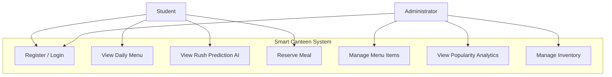
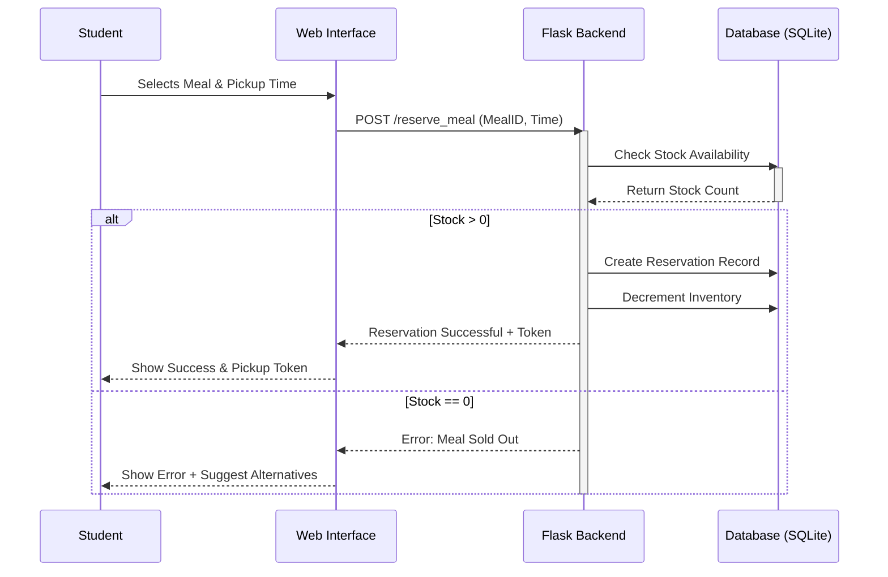
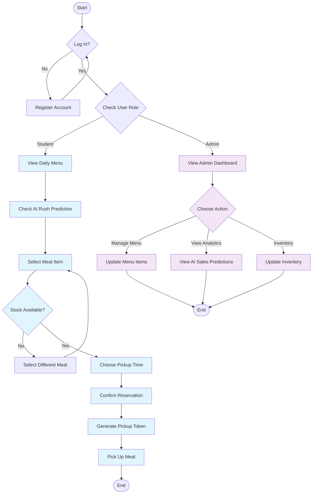
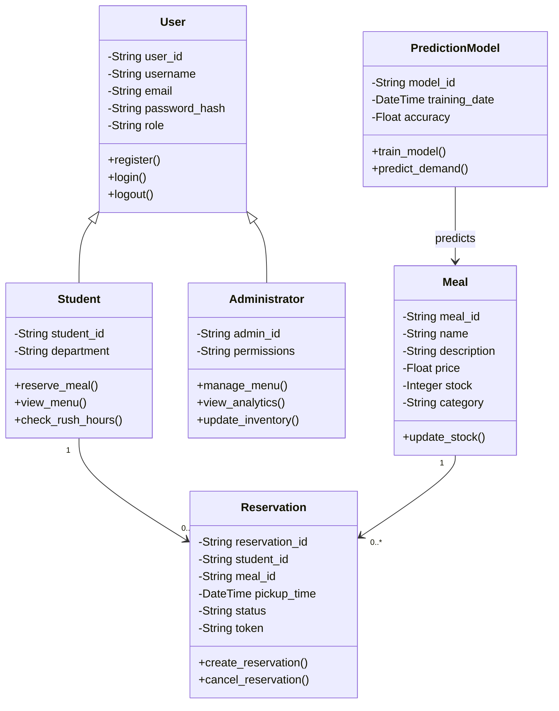

# UML DIAGRAMS - Smart Canteen System

## Overview
This document contains all UML diagrams for the AI-Powered Smart Canteen System, designed following standard UML notation.

---

## 1. USE CASE DIAGRAM

### Description
Shows the interactions between actors (Student and Administrator) and the system's main use cases.

### Actors
- **Student**: End user who reserves meals
- **Administrator**: Manages menu, inventory, and views analytics

### Use Cases

**Student Use Cases:**
- Register / Login
- View Daily Menu
- View Rush Prediction (AI)
- Reserve Meal
- View My Reservations
- Cancel Reservation

**Administrator Use Cases:**
- Register / Login (Admin credentials)
- Manage Menu Items
- View Popularity Analytics
- Manage Inventory
- Train AI Model
- View All Reservations

### Mermaid Code

---

## 2. SEQUENCE DIAGRAM - Meal Reservation Flow

### Description
Illustrates the step-by-step interaction between components during a meal reservation.

### Participants
- **Student**: User initiating reservation
- **Web Interface**: Frontend layer
- **Flask Backend**: Application logic
- **Database**: SQLite database

### Flow
1. Student selects meal and pickup time
2. Frontend sends POST request to backend
3. Backend checks stock availability
4. If stock available: creates reservation and updates inventory
5. If stock unavailable: returns error message
6. System generates pickup token
7. Confirmation displayed to student

### Mermaid Code

---

## 3. ACTIVITY DIAGRAM - End-to-End Workflow

### Description
Shows the complete user journey for both students and administrators from login to goal completion.

### Student Flow
1. Login/Register
2. View daily menu
3. Check AI rush predictions
4. Select meal
5. Check stock availability
6. Choose pickup time
7. Confirm reservation
8. Receive pickup token
9. Pick up meal

### Admin Flow
1. Login as admin
2. Access dashboard
3. Choose action:
   - Manage menu items
   - View analytics
   - Update inventory

### Mermaid Code

---

## 4. CLASS DIAGRAM - System Architecture

### Description
Defines the object-oriented structure of the system, showing classes, attributes, methods, and relationships.

### Classes

#### User (Abstract Base)
- **Attributes**: user_id, username, email, password_hash, role
- **Methods**: register(), login(), logout()

#### Student (inherits User)
- **Attributes**: student_id, department
- **Methods**: reserve_meal(), view_menu(), check_rush_hours()

#### Administrator (inherits User)
- **Attributes**: admin_id, permissions
- **Methods**: manage_menu(), view_analytics(), update_inventory()

#### Meal
- **Attributes**: meal_id, name, description, price, stock, category
- **Methods**: update_stock()

#### Reservation
- **Attributes**: reservation_id, student_id, meal_id, pickup_time, status, token
- **Methods**: create_reservation(), cancel_reservation()

#### PredictionModel
- **Attributes**: model_id, training_date, accuracy
- **Methods**: train_model(), predict_demand()

### Relationships
- User ◁─ Student (Inheritance)
- User ◁─ Administrator (Inheritance)
- Student ─── Reservation (1 to many)
- Meal ─── Reservation (1 to many)
- PredictionModel ─── Meal (predicts)

### Mermaid Code

---

## 5. ENTITY-RELATIONSHIP DIAGRAM

### Description
Database schema showing tables and their relationships.

### Entities

**users**
- PK: id
- username (unique)
- email (unique)
- password_hash
- role
- department
- created_at

**meals**
- PK: id
- name
- description
- price
- category
- stock
- is_available
- created_at

**reservations**
- PK: id
- FK: user_id → users(id)
- FK: meal_id → meals(id)
- pickup_time
- status
- token (unique)
- quantity
- created_at

**predictions**
- PK: id
- FK: meal_id → meals(id)
- date
- time_slot
- predicted_demand
- actual_demand
- created_at

**rush_hours**
- PK: id
- date
- hour
- traffic_count
- rush_level
- created_at

### Relationships
- users(1) ──── (N)reservations
- meals(1) ──── (N)reservations
- meals(1) ──── (N)predictions

---

## 6. COMPONENT DIAGRAM

### Description
Shows the high-level organization of the system's components and their dependencies.

### Components

**Presentation Layer**
- HTML Templates
- CSS Stylesheets
- JavaScript Frontend

**Application Layer**
- Flask Routes (Controllers)
- Business Logic
- Form Validation

**Data Layer**
- SQLAlchemy ORM
- Database Models
- Query Handlers

**ML Layer**
- Prediction Module
- Training Module
- Feature Engineering

**External Dependencies**
- Bootstrap Framework
- Font Awesome Icons
- Scikit-learn Library

---

## 7. DEPLOYMENT DIAGRAM

### Description
Physical architecture showing how the system is deployed.

### Nodes

**Client Machine**
- Web Browser
- JavaScript Engine

**Web Server**
- Flask Application
- Python Runtime
- Static File Server

**Database Server**
- SQLite Database
- File System Storage

**ML Model**
- Trained Model File (.pkl)
- Prediction Engine

### Connections
- Client ←→ Web Server (HTTP/HTTPS)
- Web Server ←→ Database (SQLAlchemy)
- Web Server ←→ ML Model (Pickle)

---

## Diagram Usage Guide

### For Developers
- Use these diagrams to understand system architecture
- Reference class diagram when adding new features
- Follow sequence diagrams for API implementation
- Update diagrams when making structural changes

### For Documentation
- Include relevant diagrams in technical reports
- Use activity diagrams for user guides
- Reference use case diagrams in requirements
- Attach class diagrams to design documents

### For Stakeholders
- Use case diagrams show system capabilities
- Activity diagrams demonstrate user workflows
- Component diagrams explain system structure
- Deployment diagrams show infrastructure

---

## Tools Used
- Mermaid.js for diagram rendering
- Draw.io for complex diagrams
- PlantUML for automated generation
- GitHub for diagram versioning

---

**Project developed by**: Eshwar Adduri
**Contact**: addurieshwar6@gmail.com
**Last Updated**: February 2026 
**Version**: 1.0
